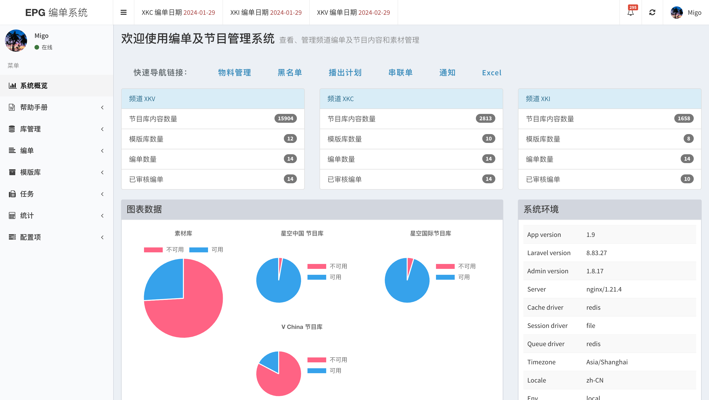
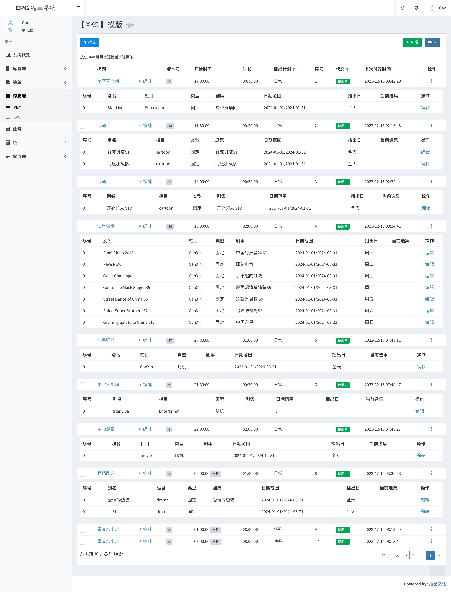
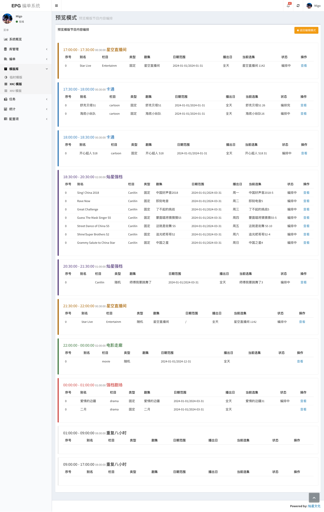
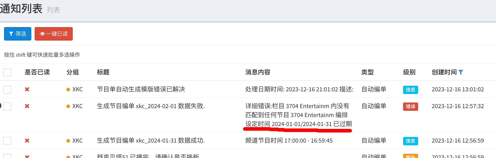
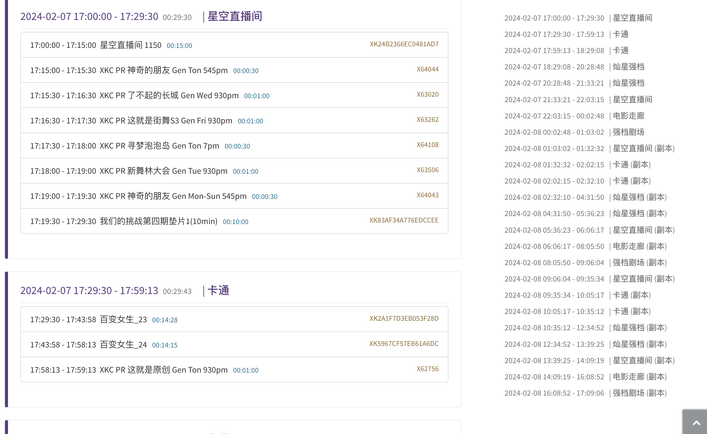
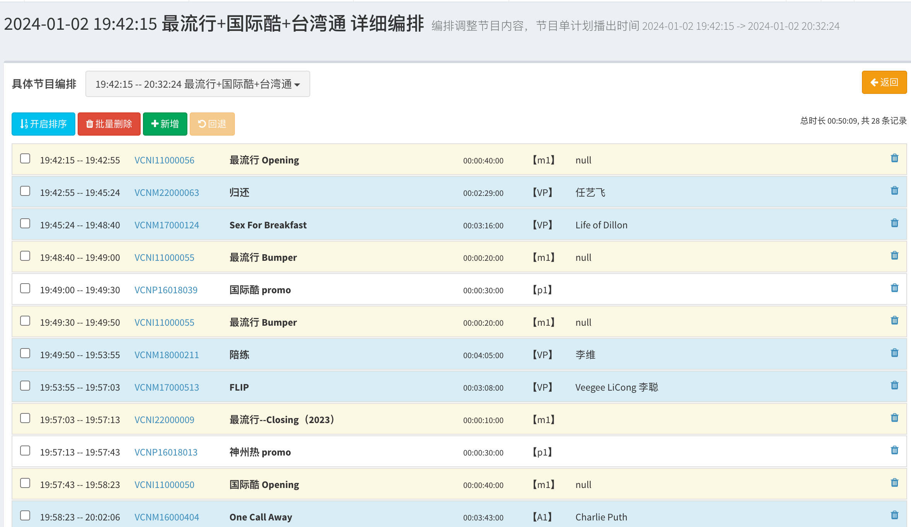

## 自动编单系统，生成24小时直播EPG编单

本系统可根据模版配置，自动批量生成直播EPG编单，并可根据媒资内容库标签进行自动填充和匹配

- 提供简单的媒资管理库功能，包括物料库（文件信息）和节目库（Metadata信息）
- 提供模版编辑功能，模版分为两类，无状态随机匹配和有状态按日期匹配
- 提供有状态模拟器功能，可预检测模版数据配置问题
- 提供导出数据功能，Excel及Xml串联单
- 通知功能
- 数据统计模块
- 消息队列异步任务处理，批量生成节目单和批量Excel处理

本开源系统基于 PHP 开发，使用了 Laravel 框架和 Laravel-admin 后台工具，集成了 PHP-Excel 插件

## 功能截图

### 首页

### 有状态编单模版

### 编单模版预览

### 自动编单

### 通知列表

### 编单预览

### 无状态编单模版

### 其他功能
- Excel 导出
- XML 生成
- 串联单查询
- 物料素材导入
- 黑名单
- 节目有效期管理

## Contributing

- [Laravel documentation](https://laravel.com/docs/contributions).
- [Laravel admin](https://laravel-admin.org/docs/zh/1.x/README).
- [Bootstrap css 3](https://getbootstrap.com/docs/3.3/css/).

## Security Vulnerabilities

邮箱地址： [marshall.goslin@gmail.com](mailto:marshall.goslin@gmail.com)， 任何问题可以联系。

## License

[MIT license](https://opensource.org/licenses/MIT).
